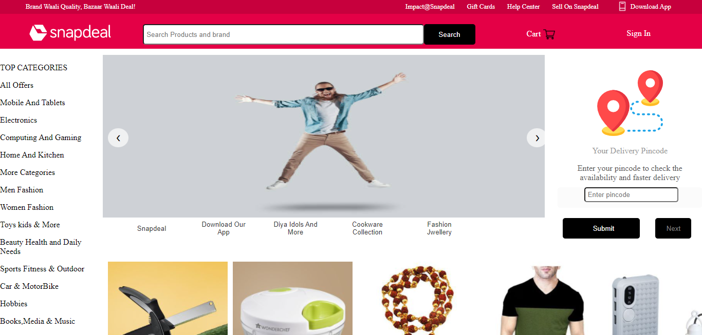
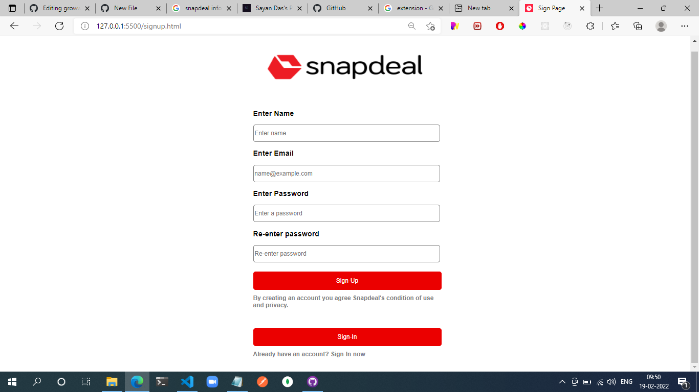
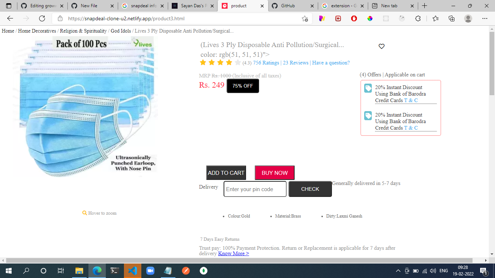
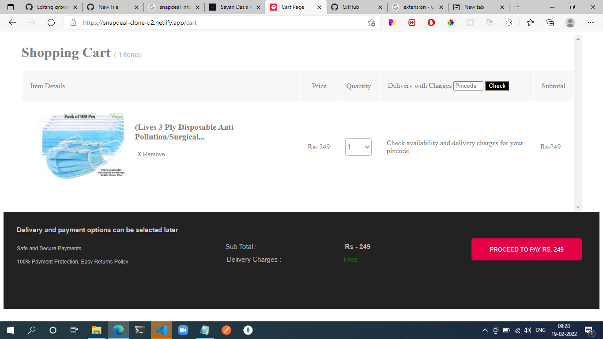
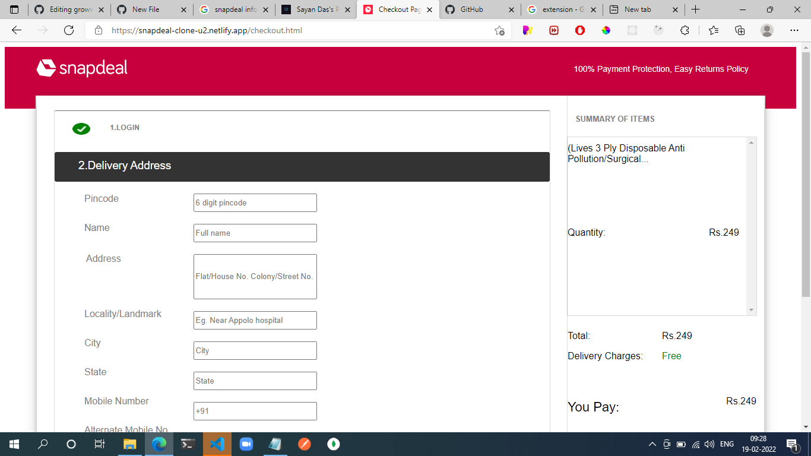
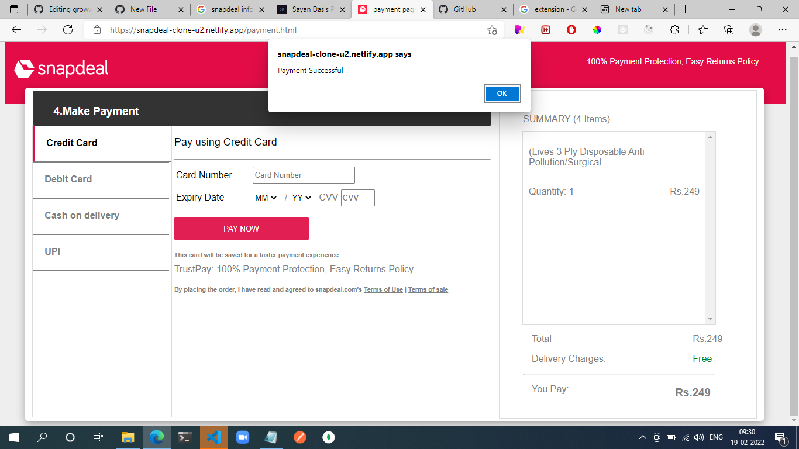

# Snapdeal-Clone
Snapdeal is one such platform that makes online shopping a boom with its exclusive deals, coupons, and discounts for consumers.. This was 1st front-end collaborative project implemented using HTML,CSS & JS only

# Features

Home Page 

Sign Up

Sign In

Product Page

Cart

Address-Page

Payment-Page

# Getting Started

<h4>Want to run in your local Machine? Great!<h4>

<h4>To run, follow these steps:</h4>

  <ul>
    <li>Clone my repository https://github.com/sayanwastaken/Snapdeal-Clone_Team36b </li>
    <li>Open that code in your VSCode Editor</li>
    <li>Install Live Server extension</li>
    <li>Open Index.html</li>
    <li>And Open with live server</li>
    <li>Then Enjoy</li>
    <li>Thats all !</li>
  </ul>
  
  # TechStacks
  <ul>
  <li>HTML</li>
  <li>CSS</li>
  <li>JAVASCRIPT</li>
  </ul>
  
  # Developers
<ul>
  <li>Sayan Das
  </li>
   <li>
     Gulshan Hashami
  </li>
   <li>
     Ashutosh Swaraj
  </li>
   <li>
    Sagar Shiv Sankar
  </li>
 
  </ul>